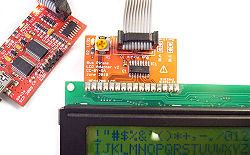

HD44780 LCD Mode
===================

  - **Bus:** [HD44780 LCD](http://ouwehand.net/%7Epeter/lcd/lcd.shtml) test library
  - **Adapter:** [74HCT595-based LCD adapter board](http://dangerousprototypes.com/docs/Bus_Pirate_LCD_adapter_v2)

Starting HD44780 LCD Mode
-------------------------
    HiZ>m    <<<open the mode menu
    1. HiZ
    …
    9. LCD
    …

    (1)>9    <<<choose LCD mode
    Clutch disengaged!!!
    To finish setup, start up the power supplies with command 'W'
    
    Ready
    LCD>

    
Command Syntax
-------------------

  * A/a/@
	  * Toggle auxiliary pin.
	  * Capital "A" sets AUX high.
	  * Small "a" sets to ground.
	  * @ sets aux to input (high impedance mode) and reads the pin value.
  * D/d (v1+ hardware only)
	  * Measure voltage on the ADC pin.
  * W/w (v1+ hardware only)
	  * Capital 'W' enables the on-board power supplies.
	  * Small 'w' disables them.
  * { or [
      * RS low. Next read/write is a COMMAND.
  * ] or }
	  * RS high. Next read/write is TEXT/DATA.
  * r
	  * Read one byte. (r:1…255 for bulk reads)
  * 0b
	  * Write this binary value.
	  * Format is 0b00000000 for a byte, but partial bytes are also fine: 0b1001.
  * 0x
	  * Write this HEX value.
	  * Format is 0x01. Partial bytes are fine: 0xA. A-F can be lower-case or capital letters.
  * 0-255
	  * Write this decimal value, check ACK.
	  * Any number not preceded by 0x or 0b is interpreted as a decimal value.
  * "_xxx_"
      * Write the ASCII text _xxx_ to the LCD.
  * , space
	  * Value delimiter.
	  * Use a comma or space to separate numbers.
	  * Any combination is fine, no delimiter is required between non-number values: {0xa6,0, 0 16 5 0b111 0xaF}.
  * &
	  * Delay 1uS. (&:1…255 for multiple delays)
  * (#) 
	  * Run macro, (0) for macro list

Macros
------------------

| (#) | Description |
|:---:| ----------- |
| 0 | Macro menu |
| 1 | LCD reset. |
| 2 | Init LCD.  |
| 3 | Clear LCD. |
| 4 | Cursor position ex:(4:0). |
| 5 | Write test text. (deprecated) |
| 6 | Write :number test numbers ex: (6:80). |
| 7 | Write :number test chracters ex: (7:80). |

Connections
------------------

The Bus Pirate can test HD44780 LCDs but it needs an IO expander chip. Currently it uses a simple 74HCT595 adapter, [build your own or buy one here](http://dangerousprototypes.com/docs/Bus_Pirate_LCD_adapter_v2).