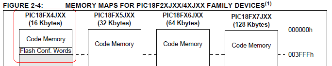

PIC Programmer Mode
===================
Pirate PIC Prog is a programmer application for the Bus Pirate, and several future Dangerous Prototypes projects.

  - **Bus:** PC keyboard interface library
  - **Connections:** three pins (PGD/PGC/VPP-MCLR), ground, and optional power
  - **Output types:**
    - 3.3volt normal output (high=3.3volts, low=ground)
    - [open collector](http://en.wikipedia.org/wiki/High_impedence) (high=Hi-Z, low=ground), [pull-up resistors](http://dangerousprototypes.com/docs/Practical_guide_to_Bus_Pirate_pull-up_resistors) required. Use open drain/open collector output types with pull-up resistors for multi-voltage interfacing.
  - **Pull-up resistors:** required for open collector output mode (2K – 10K)
  - **Maximum voltage:** 5.5volts (5 volt safe)

The [picprog programming software](http://dangerousprototypes.com/forum/index.php?topic=795) can be downloaded from the forum.

Supported Devices
-------------------
Pirate PIC Prog is in the initial testing phase. It currently supports a limited number of PICs while other features are stabilized. Some PICs require a 6-13volt to enter programming mode, these will require an [adapter](http://dangerousprototypes.com/forum/index.php?topic=649.0) (the adapter is not compatible with v4+ pinout).


| PIC family | PICs | Adapter    | ID | Erase | Write | Read |
|:---------- |:---- |:---------- |:-- |:----- |:----- |:---- |
| 18Fxx5x    | 18F2550 (USB IR Toy, Flash Destroyer) | Yes (13V) | X | X | ?? | ?? |
| 18F2/4xJxx | 18F24J50 (Logic Sniffer) | No | X | X | X | X |
| 24FJXXGAXXX | 24FJ64GA002 (Bus Pirate) | No | X | X | X | NO* |

* Read is correct, but verification fails because the current HEX parser doesn't understand the PIC24F firmware format.

Programming a 18F24J50
-------------------
    E:\picprog>picprog -p buspirate -u COM12 -s 115200 -c 18F24J50 -t HEX -w OLSv1-bootloader-v1-20MHz.hex -E -V
    (Bus) Pirate PIC Programer v0.1

    buspirate
    Initializing interface
    115200
    Entering binary mode
    BP: Setup mode...
    Setup peripherals...
    (OK)
    Found '18F24J50' in programming database :) index = 1
    Checking for 18F24J50 attached to programmer...
    Found 18F24J50 (0X4C02, ID: 0X260 REV: 0X2)
    Reading HEX file 'OLSv1-bootloader-v1-20MHz.hex' ... Read binary size = 16384
    Erasing chip... OK :)
    Writing page 0, 0000...
    Writing page 1, 0100...
    ...
    Writing page 7, 0700...
    Writing page 8, 0800...
    Skipping page 9 [ 0x000900 ], not used
    ...
    Writing page 63, 3f00...
    Reading page 0, 0000...
    Reading page 1, 0100...

Programming a 24FJ64GA002
-------------------
    E:\picprog>picprog -p buspirate -u COM12 -s 115200 -c 24FJ64GA002 -t HEX -w BPv3-Bootloader-v4.4.hex -E -V
    (Bus) Pirate PIC Programer v0.1

    buspirate
    Initializing interface
    115200
    Entering binary mode
    BP: Setup mode...
    Setup peripherals...
    (OK)
    Found '24FJ64GA002' in programming database :) index = 2
    Checking for 24FJ64GA002 attached to programmer...
    Found 24FJ64GA002 (0X447, ID: 0X447 REV: 0X3043)
    Reading HEX file 'BPv3-Bootloader-v4.4.hex' ... Read binary size = 88064
    Erasing chip... OK :)
    Writing page 0, 0000...
    Writing page 1, 0020...
    Writing page 2, 0040...

Programming a 18F2550
-------------------
    E:\picprog>picprog -p buspirate -u COM12 -s 115200 -c 18F2550 -E
    (Bus) Pirate PIC Programer v0.1

    buspirate
    Initializing interface
    115200
    Entering binary mode
    BP: Setup mode...
    Setup peripherals...
    (OK)
    Found '18F2550' in programming database :) index = 0
    Checking for 18F2550 attached to programmer...
    Found 18F2550 (0X1247, ID: 0X92 REV: 0X7)
    Erasing chip... OK :)

This demo requires the Bus Pirate high-voltage programming adapter or a similar 13volt power supply and control circuit. 18F2550 programming is not yet complete.

picprog Command Line Options
-------------------
    picprog -p PROG -u PORT -s SPEED -c CHIP -t TYPE -w | -r FILE -E | -W | -R | -V

  * -p PROG
    * Name of the interface
  * -u PORT
    * Interface port
  * -s SPEED
    * Interface speed
  * -c CHIP
    * Chip type
  * -t TYPE
    * Input/output file format {HEX,BIN}
  * -w FILE
    * File to be written to the PIC
  * -r FILE
    * File to be read from the PIC
  * -E
    * Erase Flash
  * -V
    * Verify content of flash
  * -I
    * Read the chip ID
  * -h
    * Display usage help

Add new PICs
-------------------
PiratePICprog is fairly feature complete, we just need to add settings for a bunch of PIC chips. We really need a tutorial that shows how to do this, but for now you can refer to the [existing chips](http://code.google.com/p/dangerous-prototypes-open-hardware/source/browse/trunk/PiratePICprog/pic.c#22). Just send us your settings and we'll compile a new release.

### Source location
[Currently available here](https://github.com/DangerousPrototypes/PiratePICprog).

### Building
Pirate PIC Prog is designed to be cross-platform. We're developing it on Windows with the open source [Codeblocks IDE](http://www.codeblocks.org/) and MinGW compiler. It should compile on GNU/Linux with GCC, but may need a little care and feeding first.

[Codeblocks IDE + debugger + MinGW](http://prdownload.berlios.de/codeblocks/codeblocks-10.05mingw-setup.exe) easy installer

### Adding Specific PICs to the pic.c file
The PICs will be added on a pic_chip[] array of struct pic_chip_t datatype. 

```C
struct pic_chip_t {
   const char *name;
   uint16_t ID;
   uint32_t flash;
   uint32_t eeprom;
   uint16_t family;
   uint32_t boot_block_start;
   uint32_t boot_block_end;
   uint32_t code_memory_start;
   uint32_t code_memory_end;
   uint32_t flash_config_start;
   uint32_t flash_config_end;
};
```
For example, the PIC18F24J50 is defined as follows: 
```C
{
   .name = "18F24J50",
   .ID = 0x260,
   .flash = 16*1024,
   .eeprom = 0,
   .family = FAMILY_18F2xJxx,
   .code_memory_start = 0x000000,
   .code_memory_end =   0x007FFF,
   .flash_config_start = 0x3FF8,
   .flash_config_end= 0x3FFF,
}
```
#### PIC Chip Structure Field Descriptions
  * .name
    * This is the name of the device. This is important and should have a descriptive name because this is being referred for finding the reference for function interfaces to be used.
  * .ID
    * Device ID.
    * 
    * Convert 0x4C to binary, then append 3 zeroes (left-shift 3 bits)
    * eg. (0x4C << 3) = 0x260
  * .flash
    * Flash Size in bytes
    * 
  * .eeprom
    * EEPROM size. (Currently unused)
  * .family
    * Device family, from an enum (also in pic.c).
    * One of {FAMILY_18F2xJxx, FAMILY_24FJxxGAxxx, FAMILY_18Fx5xx}.
  * .code_memory_start
    * Currently unused.
    * The base address for the flash block
  * .code_memory_end
    * Currently unused.
    * The last valid address for the flash block (16-bit aligned). Present convention uses the address 2 bytes before the flash config words.
  * .flash_config_start
    * Currently unused.
    * Base address for the Flash Configuration Words memory.
  * .flash_config_end
    * Currently unused.
    * The last valid address for the flash configuration words memory (8-bit aligned).
   
### Adding Specific PIC Families to the pic.c file
The PIC Families will be added on the pic_family[] array of struct pic_family_t datatype.
Additionally, a new entry should be added to the family enumeration, and a new string should be added to the command line options processor.
```C
struct pic_family_t {
    uint32_t family;
    enum proto_t proto;
    uint32_t ID_addr;
    uint8_t word_size;
    uint16_t page_size;
    enum icsp_t icsp_type;
    uint32_t icsp_key;
    uint16_t erase_key[4];
    uint32_t write_delay;
    uint32_t erase_delay;
    uint32_t config_addr;
};
```
For example, the PIC_18F2xJxx family is defined as follows:
```C
{
    .family = FAMILY_18F2xJxx,
    .proto = PROTO_PIC18,
    .ID_addr = 0x3ffffe,
    .word_size = 2, //bytes
    .page_size = 64, //bytes (32 words)
    .icsp_type = ICSP_LVPP,
    .icsp_key = 0x4d434850,
    .erase_key = { 0x0101, 0x8080 },
    .write_delay = 1,
    .erase_delay = 524,
    .config_addr =0x300000,   
}
```

#### PIC Family Structure Field Descriptions
  * .family
    * from the FAMILY enumeration
  * .proto
    * Programming protocol to use.
    * from the PROTO enumeration.
  * .ID_addr
    * Base address of the device ID registers in the memory map.
  * .word_size
    * Currently unused
    * Specify the number of bytes in a word. 1 for 8-bit devices, 2 for 16-bit devices.
  * .page_size
    * The size of the device's write buffer.
  * .icsp_type
    * From the ICSP enumeration
    * ICSP_LVPP for low voltage programming, ICSP_HVPP for high voltage programming.
    * HVP requires an adapter.
  * .icsp_key
    * The Progam/Verify Entry Code for this device family.
  * .erase_key
    * The bulk erase key for this family, specified as an array of 16-bit numbers.
    * erase_key[0] is the higher address written first.
    * erase_key[1] is the lower address written second.
  * .write_delay
    * Currently unused
  * .erase_delay
    * Milliseconds to wait after erasing the device.
  * .config_addr
    * Currently unused
    
Connections
------------------

| Bus Pirate | Dir. | Circuit    | Description   |
| ----------:|:----:|:---------- | ------------- |
| MOSI       | →    | PGD        | Program data  |
| CLK        | →    | PGC        | Clock signal  |
| CS         | →    | VPP/MCLR   | Programming control |
| GND        | ⏚    | GND        | Signal Ground |
| 3.3v/5v    | →    | VDD        | Power (optional) |

### Additional signals used by the HVP adapter
| Bus Pirate | Dir. | Circuit    | Description   |
| ----------:|:----:|:---------- | ------------- |
| MISO       | →    | VPP_CTL    | Pull-up power enable |
| AUX        | →    | VPPEN      | Programming power enable |
| VPU        | ←    | VTARGET    | Pull-up voltage |
