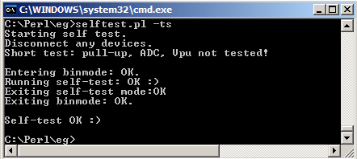

Self-test
=========

Since v2 the Bus Pirate firmware has included a [self-test](http://dangerousprototypes.com/2009/07/28/bus-pirate-self-test-guide/) that verifies the function of pins and peripherals. The current firmware adds a self-test capability to the [binary bitbang mode](http://dangerousprototypes.com/2009/10/09/bus-pirate-raw-bitbang-mode/). This is a useful way for applications to test the Bus Pirate, and for manufacturing quality control.

**Self-test commands**

-   00010000 - Short self-test
-   00010001 - Long test (requires jumpers between +5 and Vpu, +3.3 and ADC)

Self-tests are access from the [binary bitbang mode](http://dangerousprototypes.com/2009/10/09/bus-pirate-raw-bitbang-mode/). There are actually two self-tests available. The full test is the same as self-test in the user terminal, it requires jumpers between two sets of pins in order to test some features. The short test eliminates the six checks that require jumpers.

After the test is complete, the Bus Pirate responds with the number of errors. It also echoes any input plus the number of errors. The MODE LED blinks if the test was successful, or remains solid if there were errors. Exit the self-test by sending 0xff, the Bus Pirate will respond 0x01 and return to binary bitbang mode.

There's a simple [Perl self-test example](https://github.com/BusPirate/Bus_Pirate/blob/master/scripts/selftest.pl) in our [scripts folder](https://github.com/BusPirate/Bus_Pirate/blob/master/scripts/). Specify the Bus Pirate serial port with -p, and choose a full test (-tf) or a short test (-ts). Run the script without options for a help page.
