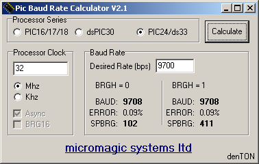
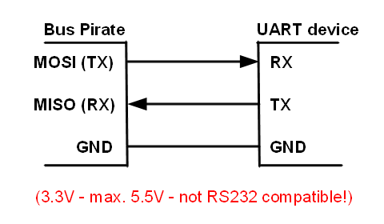

UART Mode
===================
UART is also known as the common PC serial port. A PC serial port operates at full RS232 voltage levels (-13volts to +13volts), which are not compatible with the Bus Pirate.

  - **Bus:** [UART](https://en.wikipedia.org/wiki/Universal_asynchronous_receiver/transmitter), [MIDI](http://en.wikipedia.org/wiki/Musical_Instrument_Digital_Interface)
  - **Connections:** two pins (RX/TX) and ground
  - **Output types:** 
    - 3.3volt normal output (high=3.3volts, low=ground)
    - [open drain/open collector](http://en.wikipedia.org/wiki/High_impedence) (high=Hi-Z, low=ground), [pull-up resistors](http://dangerousprototypes.com/docs/Practical_guide_to_Bus_Pirate_pull-up_resistors) required. Use open drain/open collector output types with pull-up resistors for multi-voltage interfacing.
  - **Pull-up resistors:** required for open collector output mode (2K – 10K)
  - **Maximum voltage:** 5.5volts (5volt safe)
  - **Speed:** (BPS) 300, 1200, 2400, 4800, 9600, 19200, 38400, 57600, 115200, 31250 (v2.7+), BRG (v5.1+)
  - **Data bits and parity:** 8/none, 8/even, 8/odd, 9/none
  - **Stop bits:** 1,2
  - **Recieve polarity:** idle 1, idle 0

Bus Requirements
---------------------

### Pull-up resistors

In open-collector mode, it requires pull-up resistors to hold the RX and TX lines high.

Starting UART Mode
---------------------

    HiZ>m    <<<open the mode menu
    1 . HiZ
    2 . …
    4 . UART
    …
    (1)>3    <<<choose UART mode
    Set serial port speed: (bps)
     1. 300
     2. 1200
     3. 2400
     4. 4800
     5. 9600
     6. 19200
     7. 38400
     8. 57600
     9. 115200
    10. BRG raw value
    
    (1)>5    <<<choose UART speed
    Data bits and parity:
     1. 8, NONE *default
     2. 8, EVEN
     3. 8, ODD
     4. 9, NONE
    (1)>     <<<choose data bits per frame (default accepted)
    Stop bits:
     1. 1 *default
     2. 2
    (1)>     <<<choose frame stop bits (default accepted)
    Receive polarity:
     1. Idle 1 *default
     2. Idle 0
    (1)>     <<<choose polarity (default accepted)
    Select output type:
     1. Open drain (H=Hi-Z, L=GND)
     2. Normal (H=3.3V, L=GND)

    (1)>2    <<<choose output type
    Ready
    UART>

Command Syntax
-------------------

  * A/a/@
	  * Toggle auxiliary pin.
	  * Capital “A” sets AUX high.
	  * Small “a” sets to ground.
	  * @ sets aux to input (high impedance mode) and reads the pin value.
  * D/d (v1+ hardware only)
	  * Measure voltage on the ADC pin.
  * W/w (v1+ hardware only)
	  * Capital ‘W' enables the on-board power supplies.
	  * Small ‘w' disables them.
  * [
      * Open UART, discard received bytes.
  * {
	  * Open UART, display data as it arrives asynchronously. 
  * ] or }
	  * Close UART.
  * r
	  * Check UART for byte, or fail if empty.
      * Displays framing (-f) and parity (-p) errors ([more](#r-read-a-byte)). (r:1…255 for bulk reads)
  * 0b
	  * Write this binary value.
	  * Format is 0b00000000 for a byte, but partial bytes are also fine: 0b1001.
  * 0x
	  * Write this HEX value.
	  * Format is 0x01. Partial bytes are fine: 0xA. A-F can be lower-case or capital letters.
  * 0-255
	  * Write this decimal value, check ACK.
	  * Any number not preceded by 0x or 0b is interpreted as a decimal value.
  * , space
	  * Value delimiter.
	  * Use a comma or space to separate numbers.
	  * Any combination is fine, no delimiter is required between non-number values: {0xa6,0, 0 16 5 0b111 0xaF}.
  * &
	  * Delay 1uS. (&:1…255 for multiple delays)
  * (#) 
	  * Run macro, (0) for macro list 

### r read a byte

UART mode requires special handling compared to the other Bus Pirate modes because data can arrive at any time. UART mode displays framing and parity errors, and automatically clears buffer overruns.

###  Parity and framing errors

    READ: -p -f 0×40 <<<-p -f flag set

The Bus Pirate reports framing errors (-f) and parity errors (-p) when reading a byte from the UART. It's unlikely you'll see these errors unless the UART speed is mismatched with the sender.

### Buffer overrun errors

The Bus Pirate hardware has a four-byte UART buffer that holds data until you read it with an 'r' command, or until it can be printed to the terminal if live display is enabled with '['. After it fills, new data will be lost. This is called a buffer overrun.

    READ: 0x40 *Bytes dropped*<<<bytes dropped error

The Bus Pirate detects buffer errors, clears them, and alerts you of dropped bytes. The overrun bit is cleared any time you use the r, {, or [ commands. If you close the live UART display (]) and more than 5 bytes come in, the next read command (r) will clear the error and print the *bytes dropped* warning.

Prevent buffer problems by reducing the amount of data the Bus Pirate transfers over USB for each byte of UART data. Raw display mode reduces the four byte hex value 0x00 to a single raw byte value. A better way is to use macro (1) or (2) to view unformatted UART output, this is a 1:1 transfer of bytes that should work at the highest possible speeds.

### Custom baud rate

A custom baud rate is set with the BRG option in firmware v5.5+. Use a [PIC UART calculator]("http://www.micromagicsystems.com/#/pic-baud/4523812801") to find the correct value.

Set the calculator with the Bus Pirate values: PIC24, 32MHz clock. Enter the desired baud rate and hit calculate. Use the value from the BRGH=1 section. For 9700bps enter 411 at the Bus Pirate BRG prompt.

Macros
------------------

| (#) | Description |
|:---:| ----------- |
| 0 | Macro menu |
| 1 | Transparent UART bridge. Reset to exit. |
| 2 | Live raw UART monitor. Any key exits. |
| 3 | Transparent UART bridge with flow control. |
  
### Transparent UART bridge

    UART>(1)    <<<macro 1, transparent UART bridge
    UART bridge
    Reset to exit
    Are you sure?  <<<Space continues, anything else exits.

The transparent UART mode **macro (1)** creates a simple serial->USB bridge. The only way to exit this mode is to reset the Bus Pirate hardware.

Buffer overrun errors that occur during bridge mode are automatically cleared so that data continues as normal (firmware v3.0+). The MODE LED will turn off to alert you of the buffer overrun error.

**Macro (3)** is a second UART bridge mode that includes the CTS and RTS flow control signals. CTS is on the CS pin (PIC input from external circuit is passed to FTDI USB->serial chip). RTS is on the CLOCK pin (PIC output mirrors output from FTDI chip).

Note that the Bus Pirate serial port UART facing the computer (the one that connects to the USB->serial converter chip and sends text to your computer) is NOT adjusted to the same speed as the UART bridge. The USB-side serial port UART will continue to operate at the default setting (115200bps) unless adjusted with the 'b' menu.

If you use the UART bridge with a computer program that opens the virtual serial port at a different baud rate, say 9600bps, the exchange will be garbled because the Bus Pirate expects 115200bps input from the computer. Adjust the computer-side serial speed first with the 'b' menu, then start the serial bridge at the desired speed.
    
### Live UART monitor

    UART>(2)     <<<macro 2, UART monitor
    Raw UART input
    Any key to exit

The UART monitor **macro (2)** shows a live display of UART input as raw byte values without any type of formatting. Press any key to exit the live monitor. This mode works best with a terminal that can display raw byte values in a variety of formats.

This macro is like the transparent UART **macro (1)** but without transmission abilities, and it can be exited with a key press. It's useful for monitoring high-speed UART input that causes buffer overrun errors in other modes.

MIDI
------------------

[MIDI](http://en.wikipedia.org/wiki/Musical_Instrument_Digital_Interface) is a command set used by electronic (music) instruments. It travels over a standard serial UART configured for 31250bps/8/n/1. Since firmware v2.7 MIDI is a speed option in the UART library.

MIDI is a ring network, each node has an input and output socket. Each node passes messages to the next in the ring. The input and outputs are opto-isolated. The signaling is at 5volts, 5ma (current-based signaling). An adapter is required: [example 1](http://www.compuphase.com/electronics/midi_rs232.htm), [example 2](http://www.midi.org/techspecs/electrispec.php).

Connections
------------------

Connect the Bus Pirate transmit pin (TX/MOSI) to the UART device receive pin (RX). Connect the Bus Pirate receive pin (RX/MISO) to the UART device transmit pin (TX).

For macros and modes with flow control: CTS is on the CS pin (PIC input from external circuit is passed to FTDI USB->serial chip). RTS is on the CLOCK pin (PIC output mirrors output from FTDI chip). 

Diagram by Uwe Bannow, released under the [GNU free documentation license](http://en.wikipedia.org/wiki/Wikipedia:Text_of_the_GNU_Free_Documentation_License).
